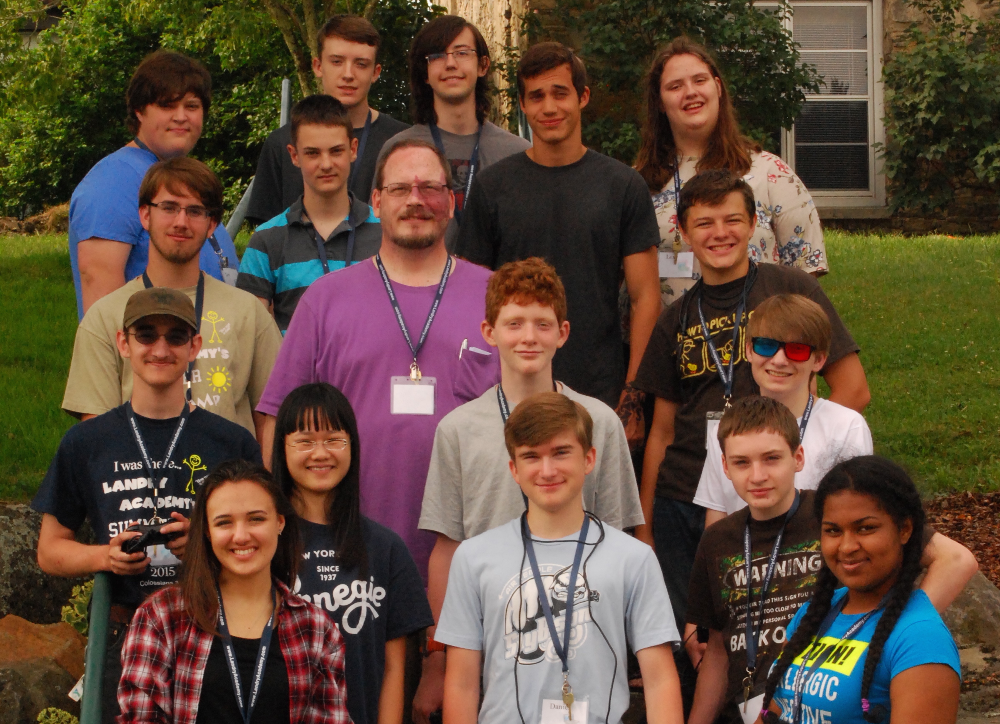
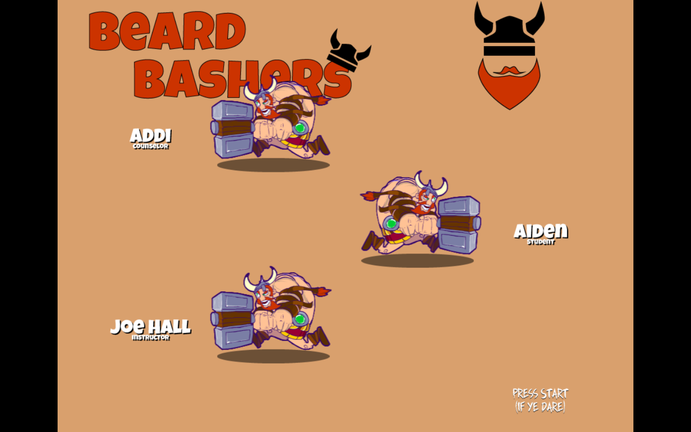

## Overview

Landry Academy's Computer Camp 2015 had 15 students. Most had never touched a compiler before this class.

The largest group yet, and (IMO) the best game yet. On the first day, we brainstormed close to a dozen game ideas. After a little back and forth, we settled on a fighting game which pits camp counselors against each other. Since there are so many counselors, with few distinguishing features, it was decided that art would be a problem. So we move to the idea of having teachers battle each other. After saying it out loud, we realized that might not be a great idea either. We then decided that we would have robots fight to the death for our amusement.

We settled on placeholder art featuring vikings — and that's what we ended up using for Friday's demonstration.

We actually finished the game by Thursday (the night before the demo) and had time to squash some bugs, add some bells and whistles, and even have a tournament on the last day of camp to see which student would present our creation to the other campers.

(*Spoiler alert: It was LaMia!*)

The end result was a game that could easily be published to one of the many app stores. I'm proud of the work that the students did. Their creativity and willingness to follow through on the implementation made this one of the most enjoyable weeks of camp for me.

The 2015 Camp game can be downloaded from the following URL:    

`http://camps.moreoncode.com/Camp2015/`

## Our Game

Blah. Blah. Blah. Blah. Blah.

## Summary

Blah. Blah. Blah. Blah. Blah.

## Review Questions

Blah. Blah. Blah. Blah. Blah.

## Exercises

Blah. Blah. Blah. Blah. Blah.

